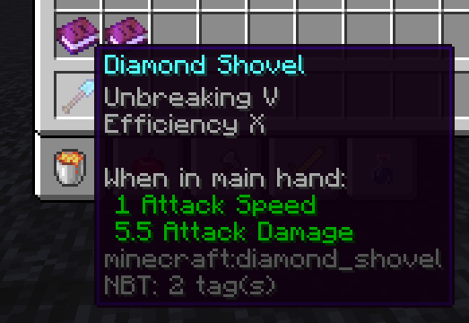

> If you don't feel like reading here's a [video](https://youtu.be/lGe1yAw3gE8) explaining everything over on my YouTube channel.

# What are Rits and the Currency system?
The currency system is a form of currency on the server that allow players to buy command-only enchanted items. Obviously this is kinda cheating which is why it's completely optional to use. The currency system is designed to be a pretty balanced. Rits aren’t impossible to get but are designed to be not easy to AFK for. The currency system has a cheat safe built in where you can only get Rits if the player is in Survival Mode. Dying to anything but a player will wipe your Rits. The currency datapack also works with Xisuma’s AFK name changer where if the player goes AFK then they won't get any Rits. 

**Xisumavoid's AFK Name Changer Datapack**
* Download - https://bit.ly/2L9ivRN
* YouTube - https://bit.ly/2YeAZIs

# How to get Rits
As of right now there are only 3 ways to earn Rits. 
* Completing regular advancements will give the player 100 Rits, completing goal advancements will give the player 1,000 Rits, and completing challenge advancements will give the player 10,000 Rits. In the early game it can be an effective strategy to grind advancements in order to gain Rits to buy items instead of mining for diamonds.
* Every mob except Zombie Pigman give Rits and depending on what mob you kill determines how much currency you get. Harder to kill mobs like a Wither give more Rits. Mobs like Zombies, Skeletons, Creepers, Spiders, and Enderman give 1 Rit, and this scales all the way up to the Enderdragon that give 10,000 Rits.
* Standing in the world will give the player 2 Rits every minute.

# PvP
Another way to get Rits is through PvP. Killing a player on the server will transfer all of their Rits to the player that killed them. Now to prevent PvP while AFKing if a player kill you while your AFK your Rits will reset and They’ll get nothing. Now you're probably asking if I have 12,000 Rits how do I keep it safe from other players? Good question, The bank. Typing `/trigger ATM set 1` will put all your pocket Rits into the bank. Once your Rits are in the bank nothing will happen to them. If you play around a little bit you can disable the `/trigger` and have a couple command blocks somewhere where you could build a bank and have the bank be the only place where players can deposit or withdraw Rits.

# Buying items and the bank
To transfer your bank Rits to your pocket type in chat `/trigger ATM set 2`. To buy anything you need a catalog. The catalog can be purchased 500 Rits by typing `/trigger buy set 1`. You can not buy anything if your Rits are in the bank. Your Rits must be in your pocket or on the player in order to buy anything. The catalog is categorized by different weapons, tools, armor, and effects. Hover over the item for the price. If you don't have the Rits for an item. It just doesn't do anything when you click it. You can also buy effects which can help with the How Did We Get Here advancement.

# I found a bug, who do I contact?
Head over to the [issues](https://github.com/TheGuitarleader/Currency/issues) page and create a new issue.
